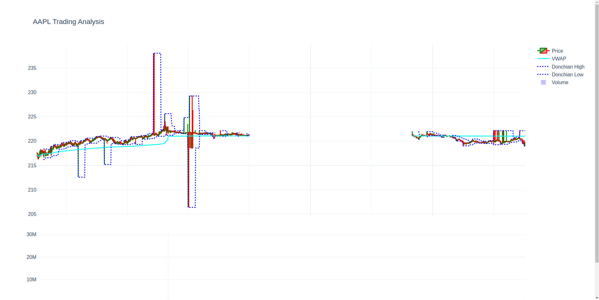

# AAPL Trading Analysis



## Features
- Fetches trade data from Alpaca API (for 1 day)
    - start date is the day before yesterday and the end date is yesterday
- Processes to 1-minute OHLC candles
- Calculates VWAP and Donchian Channels
- Interactive Plotly visualization

## Setup
1. Clone repo:
   ```bash
   git clone https://github.com/manish-cr/AAPL-stock-price-tracking.git
   ```
2. Install dependencies:
    ```bash
    pip install -r src/requirements.txt
    ```
3. Add API keys to config/.env:
    ```bash
    API_KEY=your_key_here
    SECRET_KEY=your_secret_here
    ```
## Usage:
```python
python src/trading_pipeline.py
```